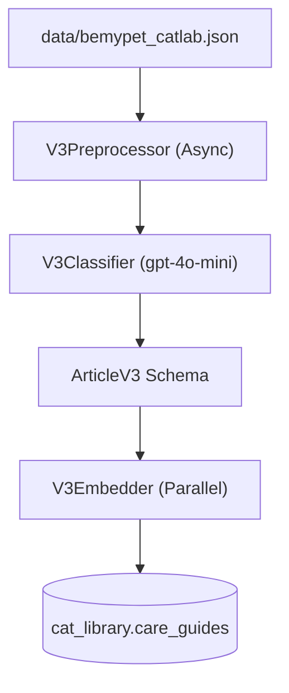

# V3 Pipeline Flow & RAG Optimization Review

## 1. Pipeline Architecture (Pure Flow)
The V3 pipeline ensures high-fidelity data ingestion by processing raw articles through an LLM-based refinement layer.

## 2. RAG Optimization Audit
We have audited the V3 design against the `HybridRetriever` logic to ensure maximum search precision.

### A. Semantic Precision (Vector Search)
- **Strategy**: Embedding only `[Title | Summary | Keywords]`.
- **Why?**: Raw text (text) often contains noise such as "안녕하세요", "광고 문의", or repetitive intros. By embedding the "Refined Essence", the vector space becomes much more distinct, preventing false positives.
- **Retriever Match**: Supports `$vectorSearch` with high semantic alignment.

### B. High-Recall Matching (Keyword Search)
- **Strategy**: Storing the full `text` and generating `tokenized_text` from it using the custom domain dictionary.
- **Why?**: If a user asks for a very specific term (e.g., "췌장염 예방 전용 보조제 이름"), it might not be in the summary. The BM25 search on the full tokenized text ensures we don't miss these detailed matches.
- **Retriever Match**: Supports Atlas Search `keyword_index` (BM25).

### C. Taxonomic Filtering
- **Strategy**: Standardizing `categories` and `specialists` into English keys.
- **Why?**: Prevents issues with synonymous Korean terms (e.g., "내과" vs "의료").
- **Retriever Match**: Directly matches the `filter` clause in `HybridRetriever`.

## 3. Implementation Plan
1.  **V3Classifier**: Extracts `title_refined`, `intent_tags`, `summary`, and `keywords`.
2.  **V3Embedder**: 
    - Batch size: 100 docs
    - Concurrency: 5 batches
    - Policy: `[Cats][Specs] Title|Keywords|Summary`
3.  **V3Loader**: Atomic upsert to `cat_library`.

---
> [!IMPORTANT]
> **RAG Readiness**: V3 is specifically engineered to solve the "False Positive" issue of V2 where generic introductions would sometimes rank higher than specific scientific content.
